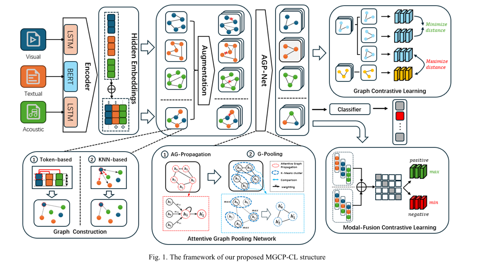

# MGCP-CL
Code for *[Multi-Modal Graph-Based Sentiment Analysis via Hybrid Contrastive Learning](https://ieeexplore.ieee.org/abstract/document/10729439)*

## Environment
Python==3.11

Pytorch==2.2.0

cuda==12.1

Transformer==4.37.2

More dependencies can follow the [requirements.txt](./requirements.txt).

## Dataset
NGCP-CL is evaluated on MOSI and MOSEI datasets.

First you need to create necessary folds for the datasets.

* `./data/`
* `./save/`
* `./save/mosi`
* `./save/mosei`

| Dataset | Link                                                        |
| ------- | ------------------------------------------------------------ |
| MOSI    | *[GoogleDrive](https://drive.google.com/file/d/172iNTfiJq4ChN8XyrwIW6NFHVgtYgOVt/view?usp=sharing)* |
| MOSEI   | *[GoogleDrive](https://drive.google.com/file/d/119n_beAYaMImWmNNF7vstK3ckxhRgrvc/view?usp=sharing)* |

Download the data of MOSI and MOSEI and place them to `./data/`.
